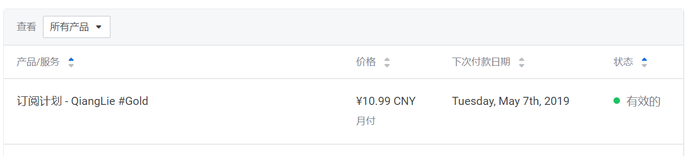
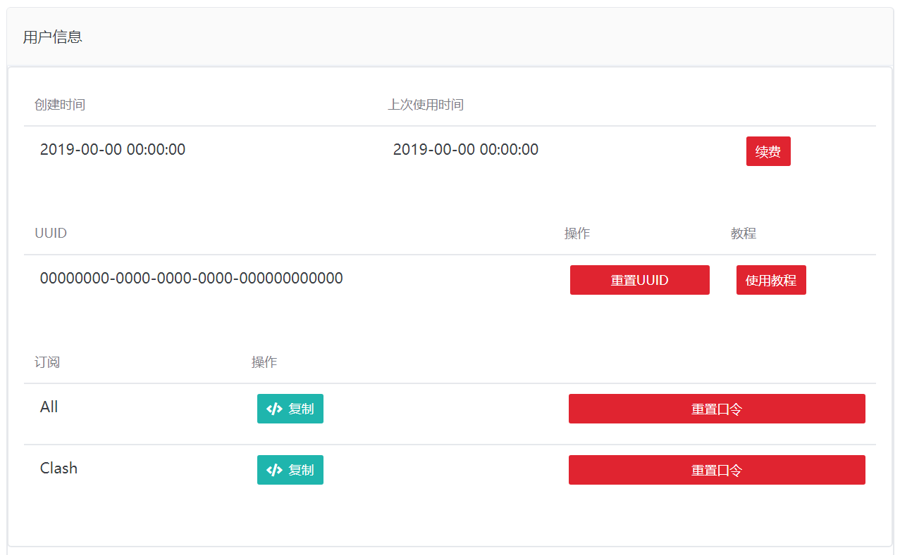

# 免费v2ray


```
vmess://ew0KICAidiI6ICIyIiwNCiAgInBzIjogIjEuMHggSEstQkdQLUEg6aaZ5rivIiwNCiAgImFkZCI6ICIxYjVtNTguaGsuc3RhdGljLmlwdjQub3Jlb2FwaS5jb20iLA0KICAicG9ydCI6ICI4MCIsDQogICJpZCI6ICJCQUZDOENGRS1GNURGLUFBRTctMjE4OS01RDBCMzNENDdGNjUiLA0KICAiYWlkIjogIjAiLA0KICAibmV0IjogIndzIiwNCiAgInR5cGUiOiAibm9uZSIsDQogICJob3N0IjogImhrMDEtY3hpbHMtY29tLmFsaWt1bmx1bi5jb20iLA0KICAicGF0aCI6ICIiLA0KICAidGxzIjogIiINCn0=
```
```
vmess://ew0KICAidiI6ICIyIiwNCiAgInBzIjogIjEuMHggSEstQkdQLUIg6aaZ5rivIiwNCiAgImFkZCI6ICIydTc2ZjkuaGsuc3RhdGljLmlwdjQub3Jlb2FwaS5jb20iLA0KICAicG9ydCI6ICI4MCIsDQogICJpZCI6ICJCQUZDOENGRS1GNURGLUFBRTctMjE4OS01RDBCMzNENDdGNjUiLA0KICAiYWlkIjogIjAiLA0KICAibmV0IjogIndzIiwNCiAgInR5cGUiOiAibm9uZSIsDQogICJob3N0IjogIiIsDQogICJwYXRoIjogIiIsDQogICJ0bHMiOiAiIg0KfQ==
```
```
vmess://ew0KICAidiI6ICIyIiwNCiAgInBzIjogIjEuMHggSEstQkdQLUMg6aaZ5rivIiwNCiAgImFkZCI6ICIybjc2ajMuY24uc3RhdGljLmlwdjQub3Jlb2FwaS5jb20iLA0KICAicG9ydCI6ICI4MCIsDQogICJpZCI6ICJCQUZDOENGRS1GNURGLUFBRTctMjE4OS01RDBCMzNENDdGNjUiLA0KICAiYWlkIjogIjAiLA0KICAibmV0IjogIndzIiwNCiAgInR5cGUiOiAibm9uZSIsDQogICJob3N0IjogIml0dW5lcy5hcHBsZS5jb20uaGsuaG1keHMuY29tIiwNCiAgInBhdGgiOiAiIiwNCiAgInRscyI6ICIiDQp9
```
```
vmess://ew0KICAidiI6ICIyIiwNCiAgInBzIjogIjEuMHggSEstQkdQLUQg6aaZ5rivIiwNCiAgImFkZCI6ICI0djJ2NHcuY24uc3RhdGljLmlwdjQub3Jlb2FwaS5jb20iLA0KICAicG9ydCI6ICI4MCIsDQogICJpZCI6ICJCQUZDOENGRS1GNURGLUFBRTctMjE4OS01RDBCMzNENDdGNjUiLA0KICAiYWlkIjogIjAiLA0KICAibmV0IjogIndzIiwNCiAgInR5cGUiOiAibm9uZSIsDQogICJob3N0IjogIml0dW5lcy5hcHBsZS5jb20uaGsuaG1keHMuY29tIiwNCiAgInBhdGgiOiAiIiwNCiAgInRscyI6ICIiDQp9
```
```
vmess://ew0KICAidiI6ICIyIiwNCiAgInBzIjogIjEuMHggSlAtQkdQLUEg5pel5pysIiwNCiAgImFkZCI6ICIxZGE3N3kuY24uc3RhdGljLmlwdjQub3Jlb2FwaS5jb20iLA0KICAicG9ydCI6ICI4MCIsDQogICJpZCI6ICJCQUZDOENGRS1GNURGLUFBRTctMjE4OS01RDBCMzNENDdGNjUiLA0KICAiYWlkIjogIjAiLA0KICAibmV0IjogIndzIiwNCiAgInR5cGUiOiAibm9uZSIsDQogICJob3N0IjogIml0dW5lcy5hcHBsZS5jb20uYWpheC5taWNyb3NvZnQuY29tLmNuLmJpbmcuY29tLmpwLnNteGh4LmNvbSIsDQogICJwYXRoIjogIiIsDQogICJ0bHMiOiAiIg0KfQ==
```
```
vmess://ew0KICAidiI6ICIyIiwNCiAgInBzIjogIjEuMHggSlAtQkdQLUIg5pel5pysIiwNCiAgImFkZCI6ICIybjc2ajMuY24uc3RhdGljLmlwdjQub3Jlb2FwaS5jb20iLA0KICAicG9ydCI6ICI4MCIsDQogICJpZCI6ICJCQUZDOENGRS1GNURGLUFBRTctMjE4OS01RDBCMzNENDdGNjUiLA0KICAiYWlkIjogIjAiLA0KICAibmV0IjogIndzIiwNCiAgInR5cGUiOiAibm9uZSIsDQogICJob3N0IjogIml0dW5lcy5hcHBsZS5jb20uYWpheC5taWNyb3NvZnQuY29tLmNuLmJpbmcuY29tLmpwLnNteGh4LmNvbSIsDQogICJwYXRoIjogIiIsDQogICJ0bHMiOiAiIg0KfQ==
```
```
vmess://ew0KICAidiI6ICIyIiwNCiAgInBzIjogIjEuMHggSlAtQkdQLUMg5pel5pysIiwNCiAgImFkZCI6ICIzNmYyMzUuY24uc3RhdGljLmlwdjQub3Jlb2FwaS5jb20iLA0KICAicG9ydCI6ICI4MCIsDQogICJpZCI6ICJCQUZDOENGRS1GNURGLUFBRTctMjE4OS01RDBCMzNENDdGNjUiLA0KICAiYWlkIjogIjAiLA0KICAibmV0IjogIndzIiwNCiAgInR5cGUiOiAibm9uZSIsDQogICJob3N0IjogIml0dW5lcy5hcHBsZS5jb20uYWpheC5taWNyb3NvZnQuY29tLmNuLmJpbmcuY29tLmpwLnNteGh4LmNvbSIsDQogICJwYXRoIjogIiIsDQogICJ0bHMiOiAiIg0KfQ==
```

# v2ray 机场墙裂推荐

http://t.smxhx.com/aff.php?aff=627

https://go.qianglie.cc/aff.php?aff=627
> 一个月¥5.99 CNY/月付
> 
> 中国大陆BGP中继网络
> 
> 香港/台湾/日本/美国等边缘网络
> 
> 50GB/月 高速流量
> 
> 每月账单日重置流量
> 
> 无限客户端 同时在线
> 
> Netflix/TVB/Hulu/HBO 访问解锁
> 
> 高达 500Mbps 速率可用

# vps推荐
服务器稳定，有CN2 GIA线路较好，适合建站和代理，支持支付宝、PayPal付款

https://bwh88.net/aff.php?aff=59041

# 客户端下载

1. Android

[v2rayNG](https://github.com/2dust/v2rayNG/releases)

2. Windows

[v2rayN](https://github.com/2dust/v2rayN/releases)

3. Mac客户端

[v2rayX](https://github.com/insisttech/v2rayX-copy/releases)

4. iOS客户端

kitsunebi 或 Kitsunebi Lite iOS 或
[注册美区Apple ID教程](https://zhuanlan.zhihu.com/p/36574047)

Shadowrocket软件账号密码

>qianglie@protonmail.com
>
>FfH#ZqBDYg66


# 使用方法

## [**各平台图文教程**](https://github.com/Alvin9999/new-pac/wiki/v2ray%E5%90%84%E5%B9%B3%E5%8F%B0%E5%9B%BE%E6%96%87%E4%BD%BF%E7%94%A8%E6%95%99%E7%A8%8B)

墙裂v2rayNG配置

1.登陆网站，单击 “产品服务” > "我的服务" > 选择 "你可用的产品/服务"。



点击 "All" 右边绿色的按钮 “复制”。


2.打开v2rayNG，点击右上角“┇”按钮，选择 “订阅”。点击右上角“+”按钮。粘贴复制的订阅地址，点击“保存”。
点击红框中的按钮。提示“订阅已更新”则订阅成功。

3.返回首页，点击“规则集”。点击右上角“┇”按钮，选择 “新建全局代理”。点击“全局代理”。返回首页，选择其中一个节点（前几个仅显示套餐信息，无法使用），点击右下角按钮连接。

首次使用会弹出“网络连接请求”，允许后再点一次按钮，直至出现如上图所示，连接成功。

> 节点Timeout解决办法：软件内 => 右上角“+” => 设置 => 系统DNS
> 
> 默认的改成 114.114.114.114
> 
> 还是无法使用请下载v2rayNG客户端